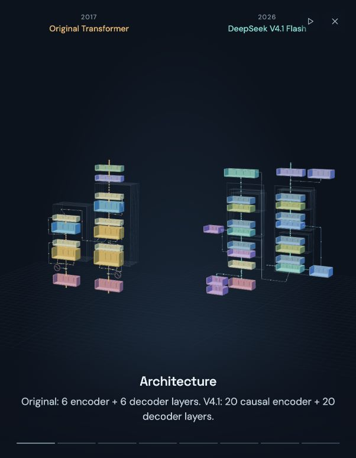
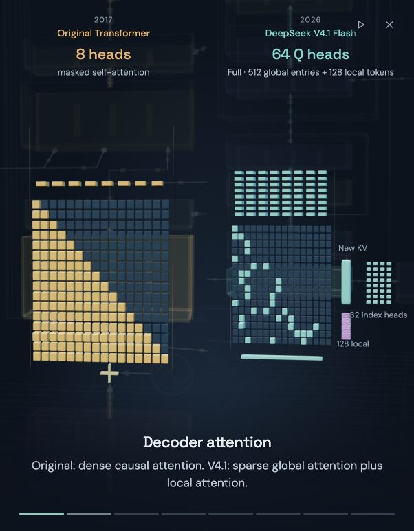

# Transformer Architecture

Explore the original Transformer and DeepSeek V4.1 Flash in interactive 3D. Follow the token flow, zoom inside the components, or take a one-minute tour of what changed.

**[Open the live demo →](https://transformer-architecture.petergostev.chatgpt.site/)**



## Explore

- **See the whole architecture.** Both models follow the structure of their papers, with animated paths connecting the components.
- **Look inside.** Click a component or zoom toward it to reveal attention heads, expert routing, residual streams and memory.
- **Play the story.** A 60-second camera tour compares attention, reuse, experts, memory, vision and drafting.
- **Change the context.** Adjust the token count to explore the traffic and cache illustrations. Pause or slow the animation whenever you like.



## Run locally

No build step, API key or model download. Python 3 is enough:

```bash
git clone https://github.com/petergpt/transformer-architecture.git
cd transformer-architecture
python3 -m http.server 8000 --directory dist
```

Open **http://localhost:8000** in a modern browser. The app uses WebGL and includes its Three.js dependencies locally.

## Make it your own

The app is plain JavaScript, CSS and HTML. Edit `dist/` and refresh the page.

| File | What it contains |
| --- | --- |
| `dist/app.js` | The 3D scene, token flow and interactions |
| `dist/presentation.mjs` | Attention, routing and other schematic calculations |
| `dist/story.mjs` · `dist/camera-path.mjs` | Story captions, timing and camera movement |
| `dist/facts.js` · `dist/sources.js` | Architecture facts and source notes |
| `blender/architectures.blend` | Editable Blender models and detail geometry |
| `scripts/build_spatial_architecture.py` | Rebuild the spatial models from the diagram data |

See [development notes](docs/development.md) for Blender editing and checks.

## Sources and scope

Based on [Attention Is All You Need](https://arxiv.org/abs/1706.03762) and the [DeepSeek V4.1 Flash technical report](https://huggingface.co/deepseek-ai/DeepSeek-V4.1-Flash/resolve/main/DeepSeek_V41_Tech_Report.pdf), checked on 10 September 2026. The app’s **Sources** panel explains individual quantities and assumptions; [provenance.json](provenance.json) records source and asset hashes.

This is an educational visualization. Token traffic, attention patterns and routing are schematic; they do not run a neural network or measure inference speed. Cache illustrations explicitly compare different storage scopes.

## License

[MIT](LICENSE) for the project code, screenshots and original Blender assets. Three.js retains its [MIT license](dist/vendor/LICENSE). Papers and referenced model materials belong to their respective authors; see [third-party notices](THIRD_PARTY_NOTICES.md).
